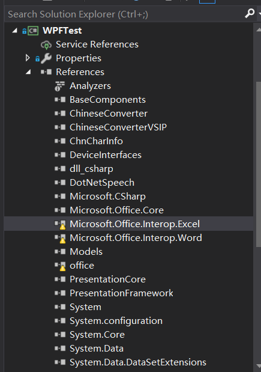
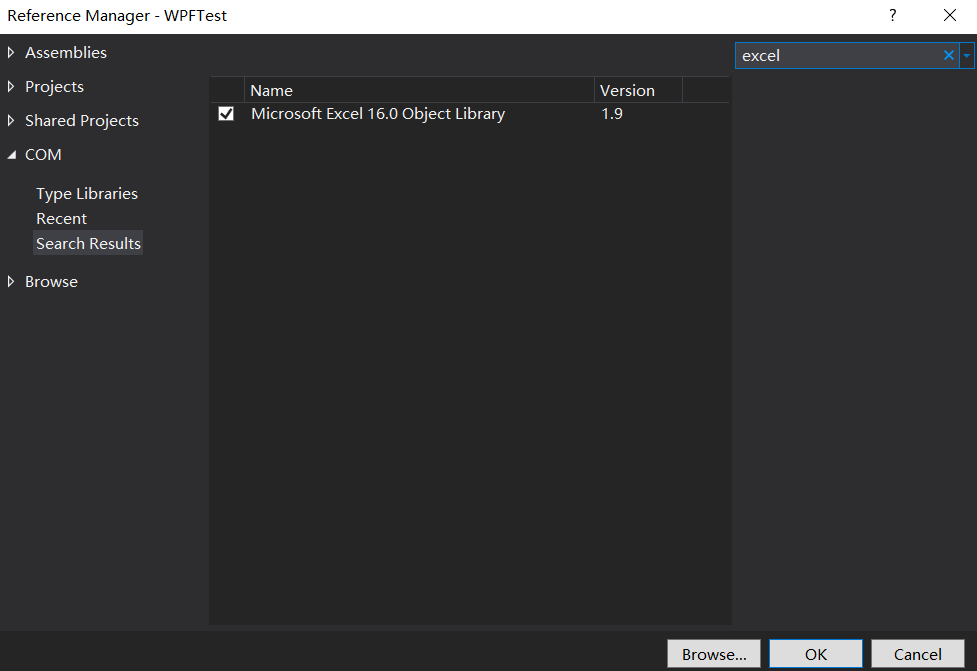
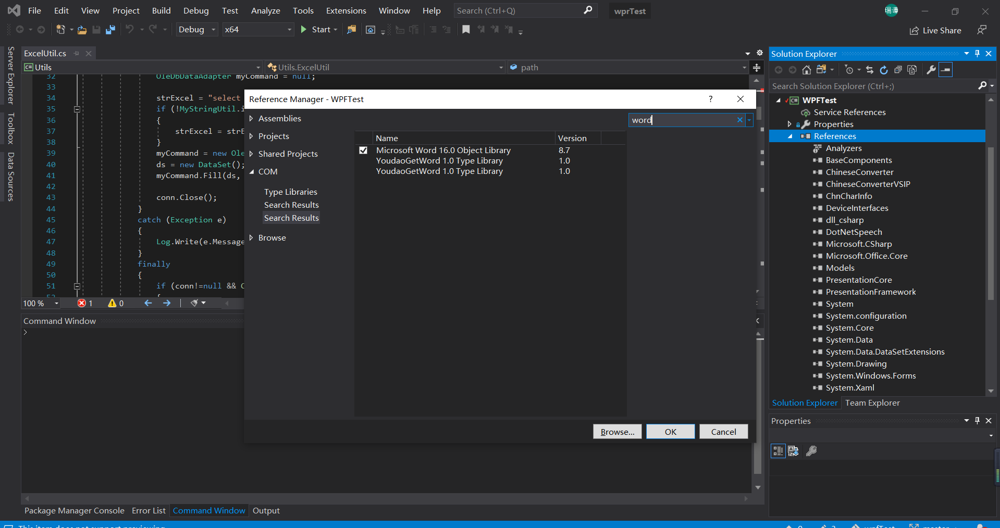
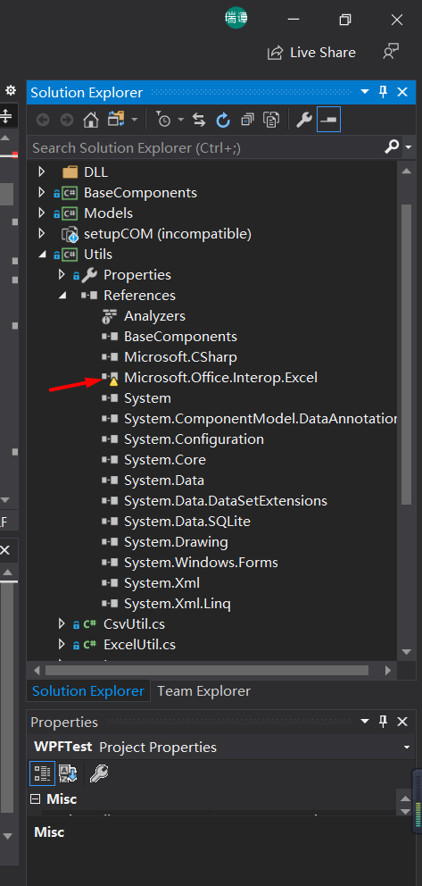
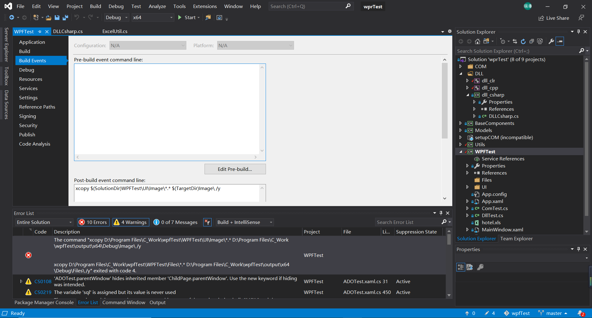
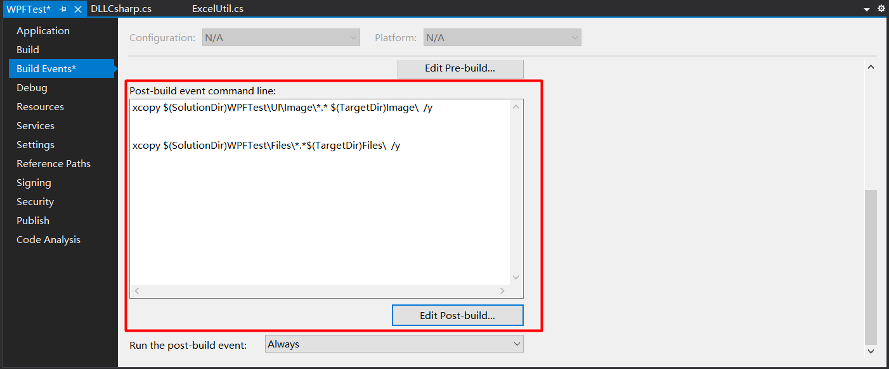

# 配置环境

## 1 重新配置COM组件

①如果我们电脑上安装的是新版本的office，比如office2019，直接运行工程就会出现错误，因为版本不对。这时我们先打开WPFTest工程的Reference，我们要移除黄色的reference。



②右键Reference，在COM组件中找到Excel和Word的COM组件，在左侧打勾，之后点击Ok。





③除了修改WPFTest工程，我们还需要移除并添加Utils工程中正确的Excel COM组件。




## 2 解决Post-build event command line命令行错误

即使我们将旧的COM组件删除，添加正确版本的COM组件，如果我们的工程路径中存在空格，我们仍然会遇到以下错误，接下来我们呈现解决方案。



右键报错工程`WPFTest->Properties->Build Events->Post Build Event`

仔细观察路径，如果$(SolutionDir)之类的盘符路径中存在空格，比如`D:\Program Files\C_Work`的路径中就存在空格，我们就要修改路径，使用双引号将路径括起来，这样就可以解决报错了。

比如报错时我的命令行如下：



加上双引号修改以后，正确的配置应该如下，之后rebuil工程就能成功了。

```
xcopy "$(SolutionDir)WPFTest\UI\Image\*.* " "$(TargetDir)Image\"  /y

xcopy "$(SolutionDir)WPFTest\Files\*.*"  "$(TargetDir)Files\"  /y
```


